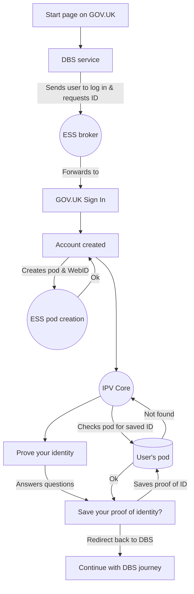
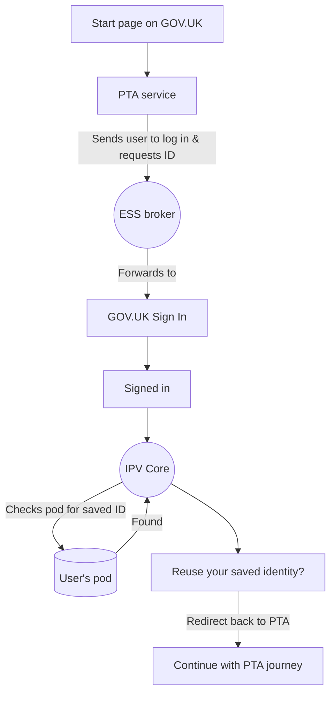
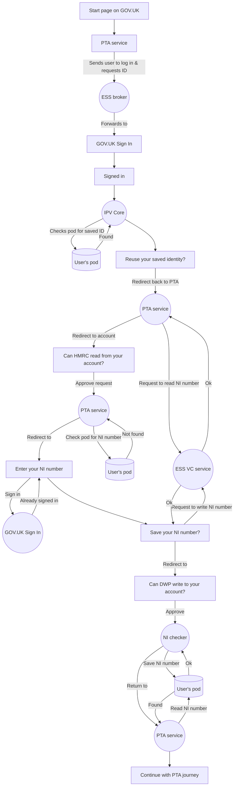

# High level architecture

See the [sequence diagrams](./sequencediagrams/) for a more detailed explanation.

Note we have simplified the non-user facing part of the identity proving journey by removing SPOT as this prototype was focused
on ID reuse which happens at IPV Core.

Rectangular steps in the flowcharts are screens the user sees, circular ones are backend services which perform an action and redirect the user on without showing them a screen.

## Request a basic DBS check

A first-time user who creates a new GOV.UK Account, proves their identity and saves that proof of identity to their account.

## Personal tax account

A returning user with a GOV.UK Account and a saved proof of identity is able to reuse that proof to shorten their journey.

## Personal tax account with verified National Insurance number

A returning user with a GOV.UK Account and a saved proof of identity creates a personal tax account.
The personal tax service asks to check their account for a saved NI number, doesn't find one and sends
the user to a fictional NI number checker service which saves a verified credential containing their
NI number to the account before returning the user to the PTA service.

This journey demonstrates the access request and grant flow to allow services outside GDS to read
and write to the user's pod. It's not all incuded in the prototype, but the thumbnail screens are
in [Figma here](https://www.figma.com/file/f6Kn3ZhjCiiJSIQpNFt7On/Solid-example-flows?node-id=2026%3A2442).

