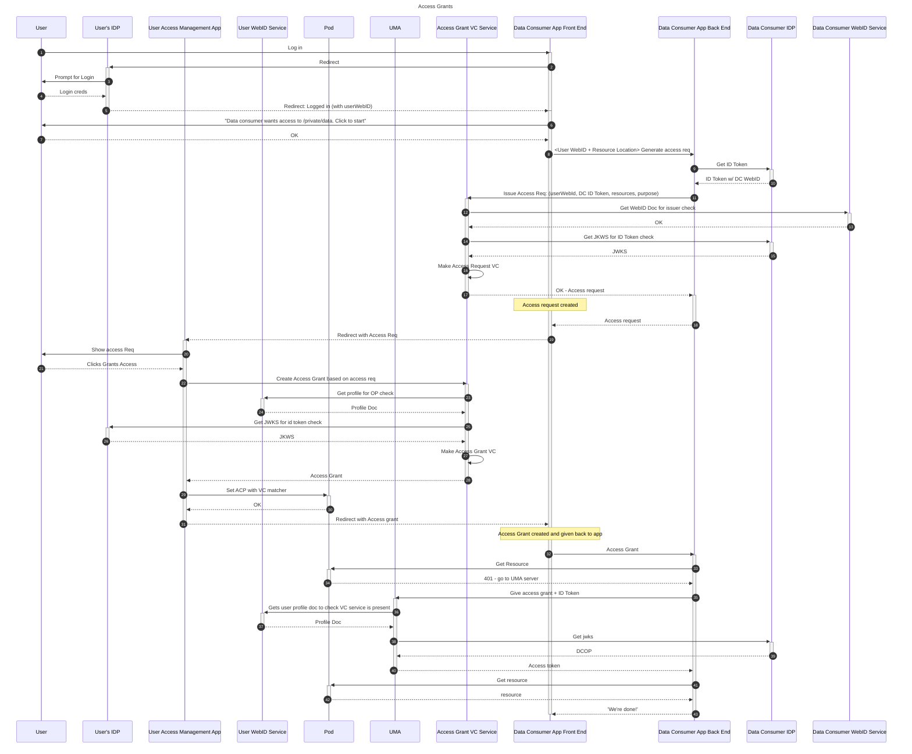

# Access Grants 

```mermaid
sequenceDiagram
autonumber

title Access Grants 
    participant User
    participant UOP as User's IDP
    participant AMA as User Access Management App
    participant UWebIDService as User WebID Service
    participant Pod
    participant UMA
    participant VC as Access Grant VC Service
    participant DCFE as Data Consumer App Front End
    participant DCBE as Data Consumer App Back End
    participant DCOP as Data Consumer IDP
    participant DCWebIDService as Data Consumer WebID Service

User ->> DCFE: Log in
activate DCFE
DCFE ->>+UOP: Redirect
UOP->>User: Prompt for Login
User -->>UOP: Login creds
UOP -->>-DCFE: Redirect: Logged in (with userWebID) 
deactivate DCFE

activate DCFE
DCFE->>User: "Data consumer wants access to /private/data. Click to start" 
User-->>DCFE: OK
DCFE->>DCBE: <User WebID + Resource Location> Generate access req
DCBE->>+DCOP: Get ID Token
DCOP-->>-DCBE: ID Token w/ DC WebID

DCBE->>VC: Issue Access Req: (userWebId, DC ID Token, resources, purpose)
activate VC
VC->>+DCWebIDService: Get WebID Doc for issuer check
DCWebIDService-->>-VC: OK
VC->>+DCOP: Get JKWS for ID Token check
DCOP-->>-VC: JWKS
VC->>VC: Make Access Request VC
VC-->>+DCBE: OK - Access request
deactivate VC

Note over DCFE: Access request created  


DCBE-->>-DCFE: Access request
DCFE-->>AMA: Redirect with Access Req
activate AMA

AMA->>User: Show access Req
User-->>AMA: Clicks Grants Access
AMA->>VC: Create Access Grant based on access req
activate VC
VC->>+UWebIDService: Get profile for OP check
UWebIDService-->>-VC: Profile Doc
VC->>+UOP: Get JWKS for id token check
UOP-->>-VC: JKWS
VC->>VC: Make Access Grant VC
VC-->>AMA: Access Grant
deactivate VC
AMA->>+Pod: Set ACP with VC matcher
Pod-->>-AMA: OK
AMA-->>DCFE: Redirect with Access grant
deactivate  AMA

Note over DCFE: Access Grant created and given back to app
DCFE->>DCBE: Access Grant
activate DCBE

DCBE->>+Pod: Get Resource
Pod-->>-DCBE: 401 - go to UMA server 

DCBE->>UMA: Give access grant + ID Token
activate UMA
UMA ->>+UWebIDService: Gets user profile doc to check VC service is present
UWebIDService -->>-UMA: Profile Doc
UMA ->>+DCOP: Get jwks
DCOP -->>-UMA: DCOP
UMA-->>DCBE: Access token 
deactivate UMA
DCBE->>+Pod: Get resource
Pod-->>-DCBE: resource 

DCBE-->>DCFE: 'We're done!'
deactivate DCBE
deactivate DCFE

```

