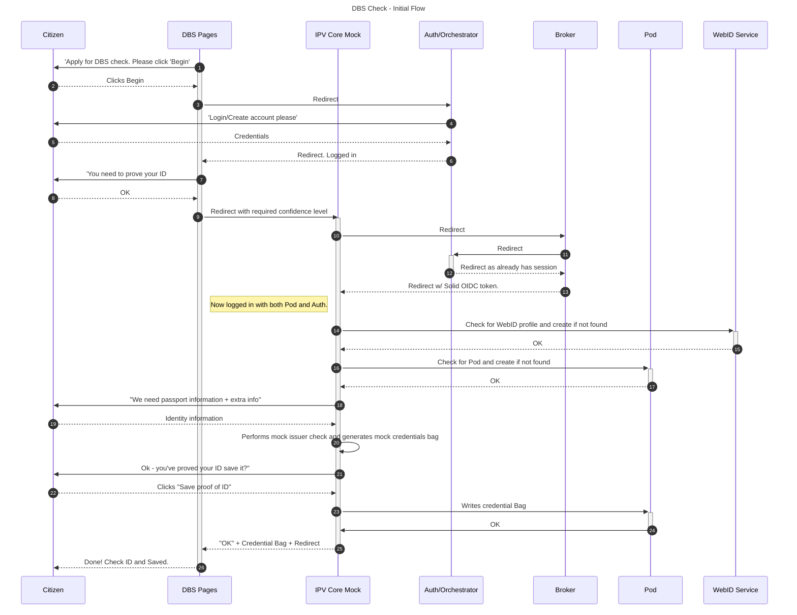
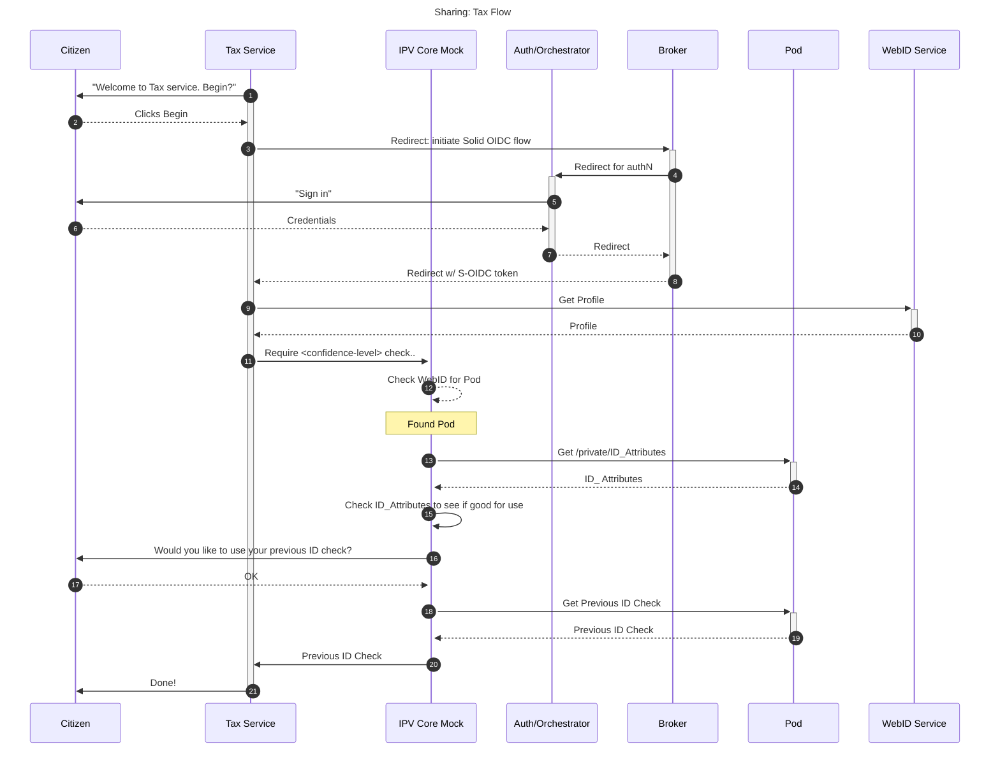
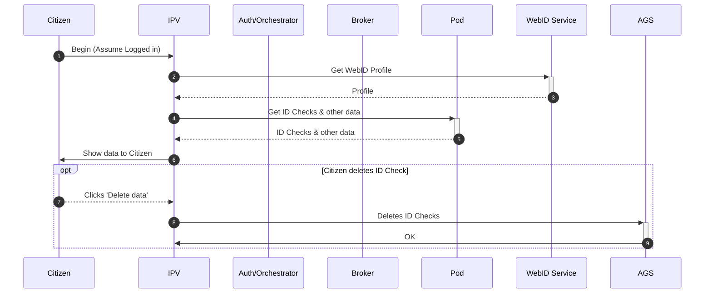

# Final Flow for App initial Write

```mermaid

sequenceDiagram
autonumber
# Service - Prove your ID plz
# IPV Provice your ID with GOVUK Account
# AUTH Signin + Create Account
# AUTH Account created!
# IPV: Use a saved Pod or first time?
# IPV: Enter you details (passport num, dob, name etc)
# IPV.... Proved!
# GDS Account: Save this proof??
# GDS Account: SAVED.
# Service: DONE! ta. 

title DBS Check - Initial Flow

    participant Citizen
    participant DemoApp as DBS Pages
    participant IPV as IPV Core Mock
    participant Auth as Auth/Orchestrator
    participant Broker
    participant Pod
    participant WebID as WebID Service


# GOV Request DBS Check
DemoApp ->> Citizen: 'Apply for DBS check. Please click 'Begin' 
activate DemoApp
Citizen -->> DemoApp: Clicks Begin
DemoApp->> Auth: Redirect
Auth ->> Citizen: 'Login/Create account please'
Citizen-->> Auth: Credentials
Auth -->> DemoApp: Redirect. Logged in

#Enter details
DemoApp ->> Citizen: 'You need to prove your ID
Citizen -->> DemoApp: OK
DemoApp->>IPV: Redirect with required confidence level 
activate IPV


#Pod login. 
IPV->> Broker: Redirect
Broker ->>+Auth:  Redirect
Auth -->>-Broker: Redirect as already has session
Broker -->> IPV: Redirect w/ Solid OIDC token. 

Note right of DemoApp: Now logged in with both Pod and Auth. 

IPV ->>+WebID: Check for WebID profile and create if not found
WebID -->>-IPV: OK

IPV ->>+Pod: Check for Pod and create if not found
Pod -->>-IPV: OK

IPV ->> Citizen: "We need passport information + extra info"
Citizen -->> IPV: Identity information
IPV->>IPV: Performs mock issuer check and generates mock credentials bag

IPV ->> Citizen: Ok - you've proved your ID save it?"
Citizen -->> IPV: Clicks "Save proof of ID"

IPV->>+Pod: Writes credential Bag
Pod->>-IPV: OK

IPV -->> DemoApp: "OK" + Credential Bag + Redirect
deactivate IPV

DemoApp -->> Citizen: Done! Check ID and Saved. 
deactivate DemoApp

```

# Second Flow:

```mermaid
sequenceDiagram
autonumber
title Sharing: Tax Flow

# GOV Personal Tax Sign up
# AUTH Signin + Create Account
# Account: Use existing Proof?
#IPV does dance
# Service - ID Proved! 

###

    participant Citizen
    participant DemoApp as Tax Service
    participant IPV as IPV Core Mock
    participant Auth as Auth/Orchestrator
    participant Broker
    participant Pod
    participant WebID as WebID Service
    
# GOV Personal Tax Sign up
# AUTH Signin + Create Account
# Account: Use existing Proof?
#IPV does dance
# Service - ID Proved! 


DemoApp ->> Citizen: "Welcome to Tax service. Begin?" 
activate DemoApp
Citizen -->> DemoApp: Clicks Begin

DemoApp ->>+Broker: Redirect: initiate Solid OIDC flow
Broker ->>+Auth: Redirect for authN
Auth ->> Citizen: "Sign in"
Citizen -->> Auth: Credentials
Auth -->>-Broker: Redirect
Broker -->>-DemoApp: Redirect w/ S-OIDC token

#Deref WebID Profile
DemoApp ->>+WebID: Get Profile
WebID -->>-DemoApp: Profile

DemoApp ->>+IPV: Require <confidence-level> check..
IPV-->>IPV: Check WebID for Pod
Note over IPV: Found Pod
IPV->>+Pod: Get /private/ID_Attributes
Pod -->>-IPV:  ID_ Attributes
IPV ->> IPV: Check ID_Attributes to see if good for use
IPV->>Citizen: Would you like to use your previous ID check?
Citizen-->> IPV:OK

IPV->>+Pod: Get Previous ID Check
Pod-->>-IPV: Previous ID Check

IPV->>DemoApp: Previous ID Check

DemoApp ->> Citizen: Done!
deactivate DemoApp

```

# Account Access 

```mermaid
sequenceDiagram
autonumber

    participant Citizen
    participant IPV
    participant Auth as Auth/Orchestrator
    participant Broker
    participant Pod
    participant WebID as WebID Service

    Citizen ->>IPV: Begin (Assume Logged in)
        
    IPV ->>+WebID: Get WebID Profile
    WebID-->>-IPV: Profile

    IPV ->>+Pod: Get ID Checks & other data
    Pod-->>-IPV: ID Checks & other data
    
    IPV->> Citizen: Show data to Citizen
            
    opt Citizen deletes ID Check
    Citizen -->> IPV: Clicks 'Delete data' 
    IPV ->>+AGS: Deletes ID Checks 
    AGS->>-IPV: OK
    end
    
```
