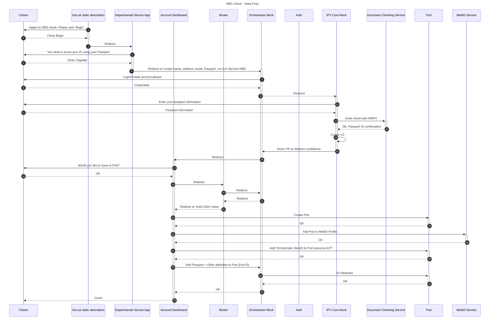
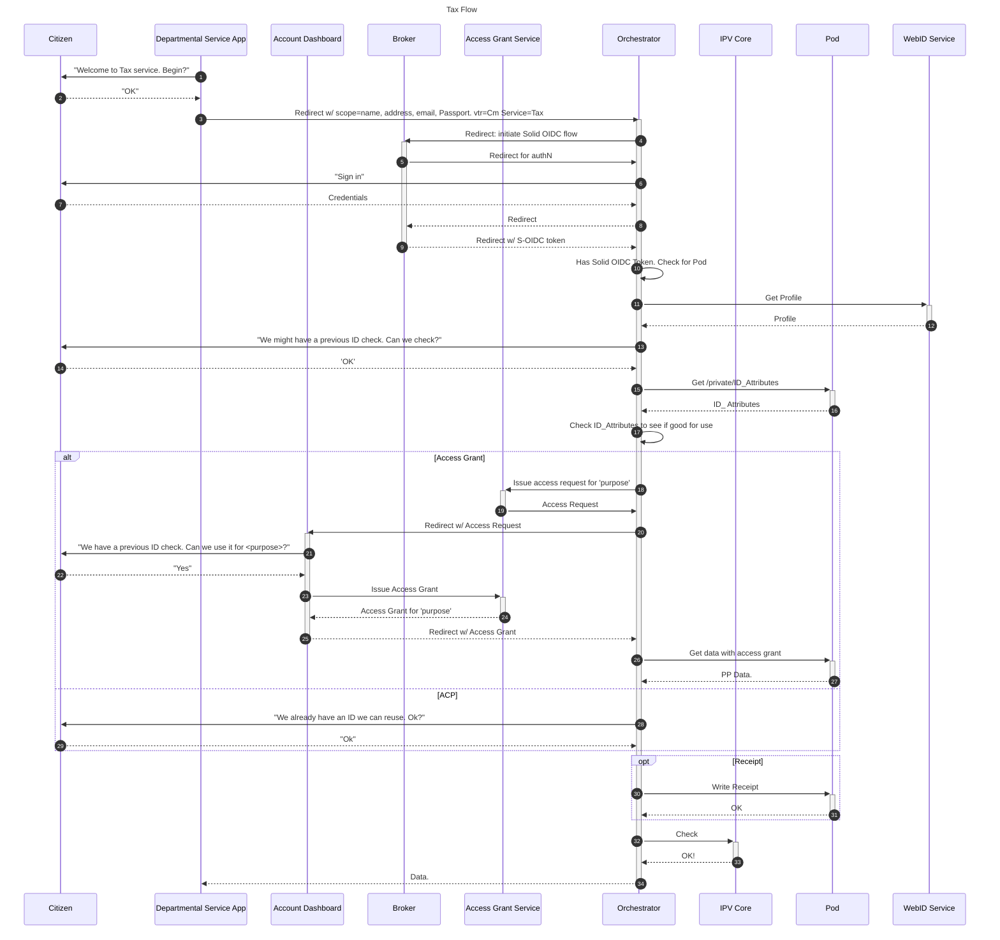
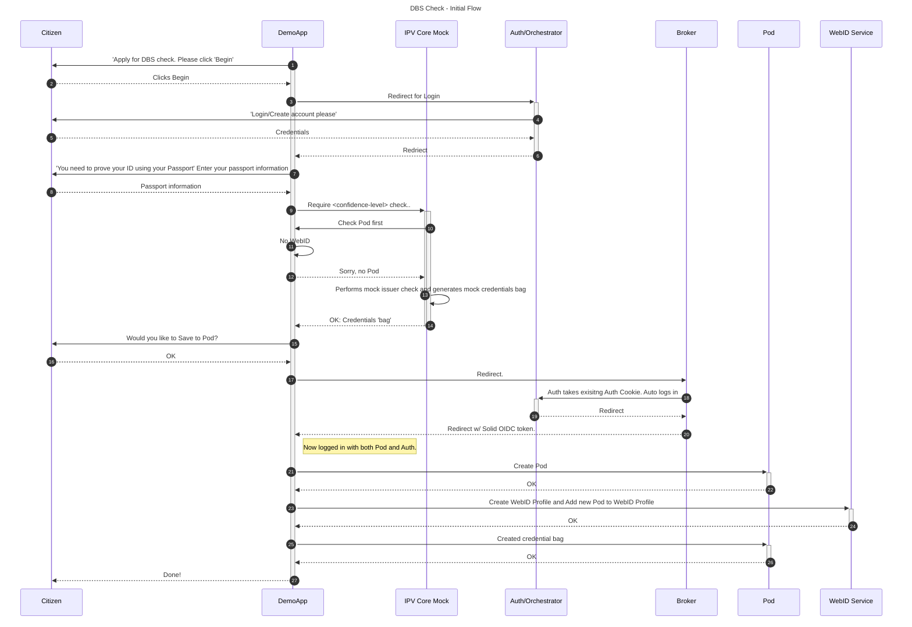
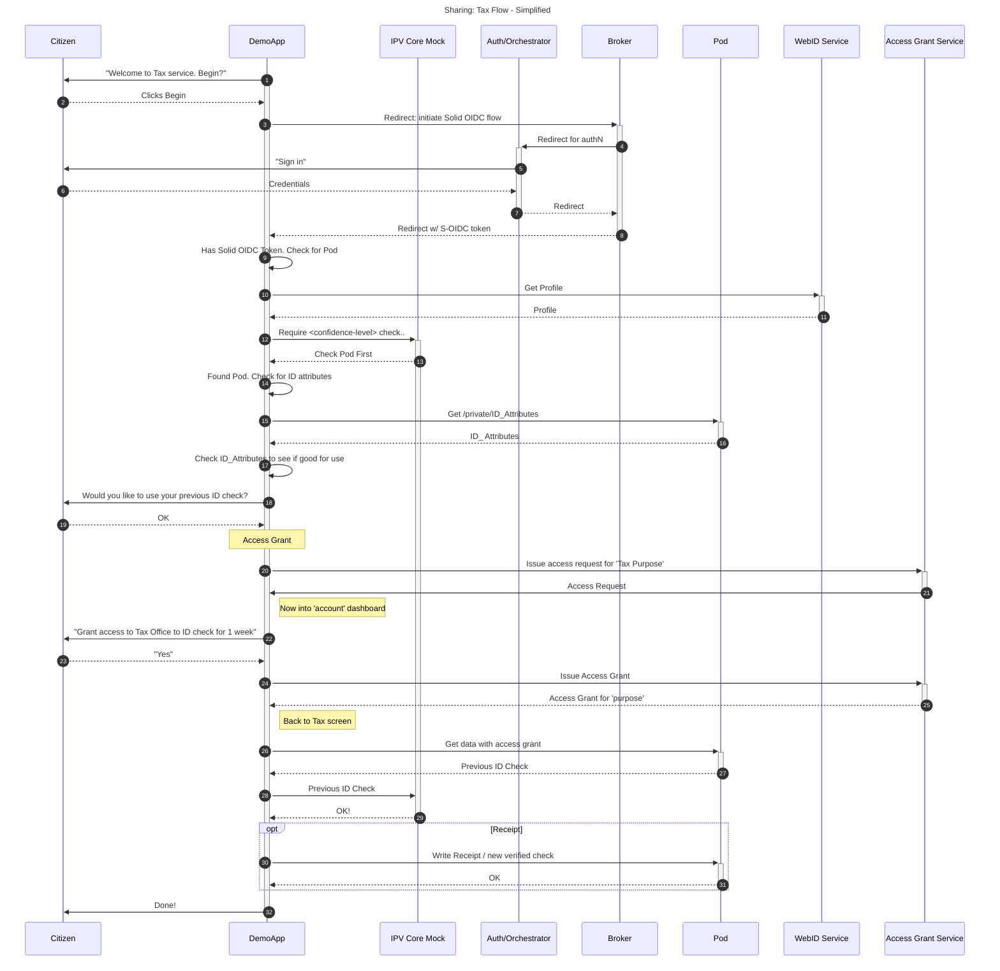
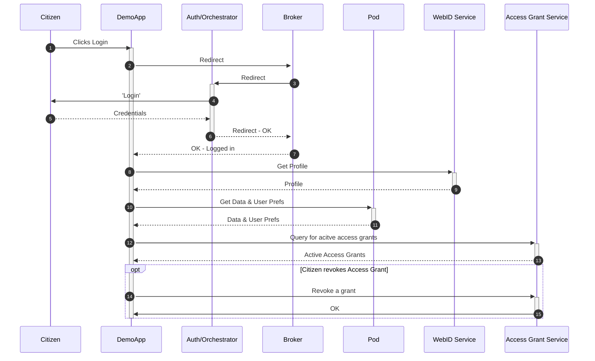
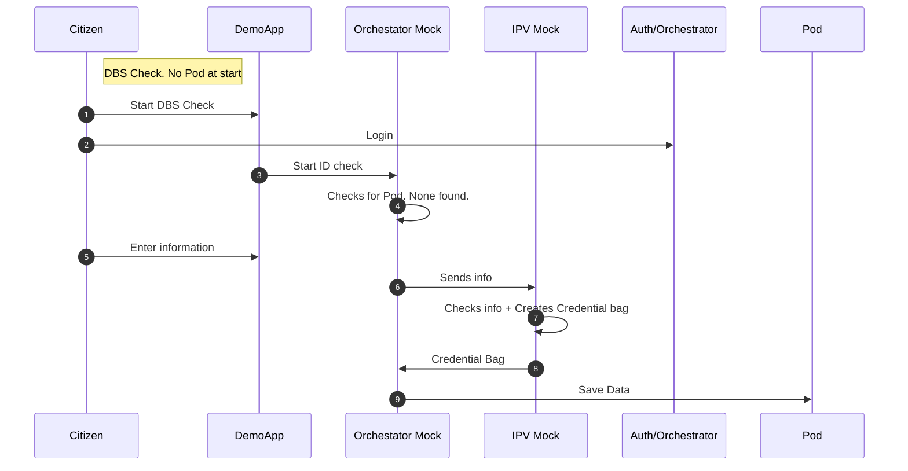
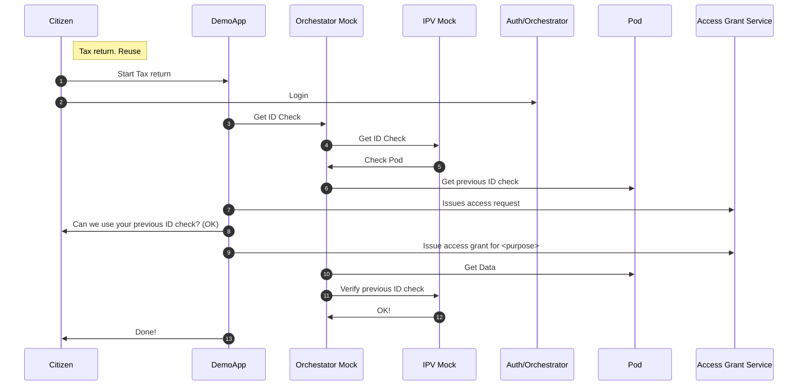
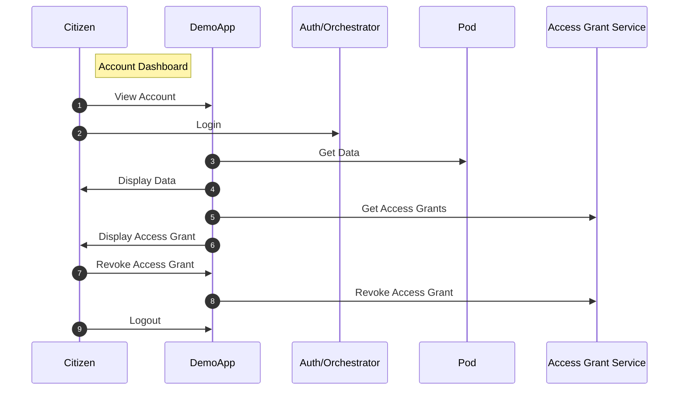

# Flow for initial Write

# Second Flow for Read

 

# Flow for Bundled' App initial Write

# Second Flow: Simplified

# Account Access 

# Basic Flow for Steering - Service 1 - DBS

# Basic Flow for Steering: Service 2 - Tax

# Basic Flow for Steering: Service 3 - Account

